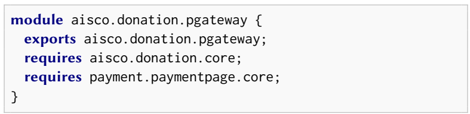

# Variability Modules for Java (VMJ)

## Introduction
Variability Modules for Java (VMJ) is a concept or architectural pattern in software development for implementing delta-oriented software product lines (SPL) in Java source code. There are several key components in developing delta-oriented SPL using VMJ, which are as follows:

### Core Module
- A module that contains **core**/**common** functionality for a variant or feature.
- For a variant or feature, there is only one core module.
- A core module consists of the following components:
    - Interface
    - Abstract component class (implements the interface)
    - Concrete component class
    - Abstract decorator class (extends the abstract component class)
- Name format: `<product-line-name>.<feature-name>.core`.

### Delta Module
- A module that contains unique and specialized functionality
- Used to modify the core module to create different products. This module can make either major or minor changes and has rules for when it can be used based on the features desired by the user. Can add, modify, or delete properties and methods from the core module or other delta modules.
- The process of wrapping other modules (core/delta) is done using the decorator pattern concept.
- Name format: `<product-line-name>.<feature-name>.<delta-name>`.
- Why is it called a **delta**? Recall that the delta symbol, which is shaped like a triangle in the context of physics and chemistry, signifies a difference.
<p align="center">
  
</p>

### Factory Class
- Functions to create the appropriate objects during the product derivation phase.
- The product derivation phase of SPLE is implemented by creating Java modules that represent new products.
- Also responsible for handling the application order of deltas.
    - If there are multi-level deltas, then the order becomes very important.
    - In UML, the order in the multi-level delta concept can be visualized using the `<<after>>` stereotype.
- Name format: `<name-interface>`Factory.
    - For example:
        - Interface name: Promo
        - Factory class name: PromoFactory
- There is a template to generate the factory class so that the factory class will be created automatically.

### Java Module
- Java modules can be used as core modules, delta modules, and product modules.
- Name format: `<product-line-name>.<feature-name>.<module-name>`.
- Each Java module will have a module-info.java file.
    - Functions to define the Java packages that are exported and the external modules that are imported (required).
    - Pattern:
        ```
        module <product-line-name>.<feature-name>.<module-name> {
            requires <product-line-name>.<feature-name>.<module-X-name>;
            requires <product-line-name>.<feature-name>.<module-Y-name>;
            requires <external-module-1-name>;  // Specifically for core modules and delta modules
            exports module <product-line-name>.<feature-name>.<module-name>;  // Specifically for core modules and delta modules
        }
        ```

## Structure Directory
- Folder `external`: Contains required external library (jar file).
- Folder `images`: Contains images used in README.md.
- Folder `lib`: Contains generated jar files from the selected core modules or delta modules.
- Folder `paymentgateway.product.<product-module-name>`: Contains generated jar files from the modules required by a product.
- Folder `src`: Contains the implementation of delta-oriented software product lines, including core modules, delta modules, and product modules.
- File `ck.properties`: Contains configuration knowledge.
- File `genfactory.sh`: Contains a script to generate a factory class for a feature with the help of the `TemplateFactory.java` file.
- File `genproduct.sh`: Contains a script to generate jar files from the modules required by a product or jar files from the selected core modules or delta modules.
- File `run.sh`: Contains a script to run the generated product jar files.
- File `TemplateFactory.java`: Template for feature factory class.

## How to Create a Factory Class Using the Factory Class Template
**Requirement**: Java 11 or later
**Factory Class Template**: `TemplateFactory.java`
```
bash genfactory.sh <product-line-name>.<feature-name> <feature-interface-name>
```
Example Feature Payment:
```
bash genfactory.sh paymentgateway.payment Payment
```

## How to Build and Run (Product Generation) Using Bash Script
### Build Product
```
bash genproduct.sh <product-line-name>.product.<product-module-name> <product-main-class>
```
Example Product Basic:
```
bash genproduct.sh paymentgateway.product.basic Basic
```

### Run Product
```
run.sh <product-line-name>.product.<product-module-name>
```
Example Product Basic:
```
bash run.sh paymentgateway.product.basic
```
### Build Module (If you want to build any module (one by one))
```
bash genproduct.sh <product-line-name>.<feature-name>.<module-name>
```
Example Payment Core Module:
```
bash genproduct.sh paymentgateway.payment.core
```

## Example: The "Payment Gateway" Case Study
- There is only one feature, which is payment.
    - There is 1 core module and 3 delta modules.
    - **Core**: Contains the elements needed for payment processing (core payment processing). It is located in the `paymentgateway.payment.core` module.
    - **Delta multi-currency support**: Supports payments in various currencies, modifies behavious the `processPayment` method. Located in the `paymentgateway.payment.multicurrencysupport` module.
    - **Delta integration with local banks**: Supports integration with various local banks in different countries, adds behavior to the `processPayment` method. Therefore, the `delta multi-currency support` must also be applied beforehand. Located in the `paymentgateway.payment.localbank` module.
    - **Delta fraud detection**: Supports the detection and prevention of suspicious transactions, adds behavior to the `processPayment` method. Located in the `paymentgateway.payment.frauddetection` module.
- There are 3 products: basic payment gateway, e-commerce payment gateway, and marketplace payment gateway.
    - **Basic payment gateway**: `Core` + `delta multi-currency support`. Located in `paymentgateway.product.basic` module.
    - **E-commerce payment gateway**: `Core` + `delta multi-currency support` + `delta fraud detection`. Located in `paymentgateway.product.ecommerce` module.
    - **Marketplace payment gateway**: `Core` + `delta multi-currency support` + `delta fraud detection` + `delta integration with local banks`. Located in `paymentgateway.product.marketplace` module.

## Summary of the Paper "An Architectural Pattern to Realize Multi Software Product Lines in Java"
### 1. Introduction
- The broader issue faced when adopting Software Product Line Engineering (SPLE) is how to manage the actual implementation.
- There are two main approaches:
    1. Using macros (like #ifdef in C/C++) or creating scripts to control the creation of product variants.
        - **Weakness**: The generated code is difficult to understand and analyze.
    2. Extending programming languages that support variability, such as Feature-Oriented Programming (FOP), Aspect-Oriented Programming (AOP), and Delta-Oriented Programming (DOP).
        - **Weakness**: One must keep up with the evolution of the programming language (e.g., the DOP implementation DeltaJ is based on Java 5), so the production environment, IDE, and analysis tools need to support this evolution (which may not always or promptly support these advancements).
- In this paper, an architectural pattern for implementing SPLE in standard Java is presented.
- The resources used are OO design patterns, Java packages, and Java modules.
- The pattern is based on a recent concept called variability modules.
- VMJ requires **Java version 9 or higher**.
- VM supports the modeling of multi-product lines (MPL) and a delta-oriented construct that presents dependencies (import & export declarations).
    - **SPL vs MPL** (in general, the difference lies in the scale and approach to managing product variation):
        - SPL
            - Developing a set of products that share the same foundation.
            - Focuses on managing variation within a single product line.
            - Example: A car company creates one model or type with various variants (engine type, interior, etc.) using SPL to easily configure a car product with that type.
        - MPL
            - Developing multiple different product lines simultaneously, where each product line may have its own SPL.
            - Focuses on managing various product lines that may have interdependencies between them, allowing SPL development on a larger scale.
            - Example: A company has several car models/types/lines (such as SUV, sedan, truck, etc.), where each model/type/line has its own SPL.

### 2. VMJ by Example
- The explanation will be provided through the case study **Adaptive Information System for Charity Organizations (AISCO)**, a software system designed to help fundraising organizations publish their activities and generate financial reports (recording income, expenses, donors, and beneficiaries, which can be done either automatically or manually).
- AISCO Feature Diagram:
    <p align="center">
    
    </p>
- AISCO Problem Mapping:
    <p align="center">
    
    </p>
- Snippet of the `FinancialReportComponent` that implements the `FinancialReport` interface. It consists of several fields and abstract methods. In this case, the `total(List<FinancialReport> rec)` method becomes an abstract method.
    <p align="center">
    
    </p>
- Snippet of the `FinancialReportImpl` that extends the component class, providing a concrete implementation of the `total(List<FinancialReport> rec)` method.
    <p align="center">
    
    </p>
- Together, the `FinancialReport` interface, the `FinancialReportComponent` class, the `FinancialReportImpl` class, and the `FinancialReportDecorator` class form the core module that represents commonalities in the financial report product line.
- To create variants of a product line, this can be realized through encapsulation with a delta module.
- One example in the AISCO case study is if we want to create a variant of the financial report that can print total revenue with administrative costs, we can create a delta (named Delta Income) to achieve this. The creation of the delta module object is done using the factory design pattern.
    <p align="center">
    
    </p>
- Once the product variant is complete, feature selection can be performed through module declaration (within the `module-info.java` file).
    - For example, product CharitySchool has features Activity, Operational, Income, Expense, and DonationViaPaymentGateway.
        <p align="center">
        
        </p>
- After feature selection is complete, add the main class to initialize the feature (initialized by calling a factory method) and integrate the product.
    - In the main class of the `CharitySchool` product, there are two financial report deltas initialized using different financial report core objects: `Income` and `Expense`. In other words, objects from the Income and Expense variants can coexist and be operated simultaneously. This is not possible with standard DOP, and the variability module concept allows for this functionality.
        <p align="center">
        
        </p>
- To run the product, it is necessary to assemble the jar files from each module required by the product.

### UML-VMJ PROFILE
- This paper extends UML-DOP to the UML-VMJ profile for MPL and VM modeling.
- The profile is defined in Eclipse Papyrus for integration with the code generator.
- UML-VMJ diagram of FinancialReport module
    <p align="center">
    
    </p>

    - The core module is modeled as a package stereotyped `<<module>>`.
    - The delta module is modeled as a package stereotyped `<<delta>>`, for example in the `DIncome` package.
        - `DIncome` adds 1 new field, named `paymentMethod`, and 1 new function, `adminFee()`. Additionally, DIncome modifies 2 functions, `total()` and `printHeader()`.
    - The result of delta application is represented as a class `[ProductLine]Impl` with the stereotype `<<modifiedClass>>`.
    - The goal of the delta module is to implement several features.
    - Features are represented as UML components with the stereotype `<<feature>>`.
    - Configuration knowledge that describes the delta application conditions is modeled as UML dependencies stereotyped `<<when>>` or `<<after>>`.
- UML-VMJ diagram of product CharitySchool
    <p align="center">
    
    </p>

    - The product is represented as a UML component stereotyped `<<product>>`.
    - Feature selection is represented as a UML dependency between the product and features.

### VMJ ARCHITECTURAL PATTERN
<p align="center">

</p>
**1. Design Patterns**
- **Decorator Pattern**
    - Delta modules can add, remove, or modify behavior without changing existing code.
    = The Decorator pattern provides a mechanism to dynamically change an object's behavior without altering the original class implementation.
    - Variant behavior is handled by an abstract decorator class `[Product]Decorator` extending `[Product]Component`.
    - Concrete decorators are implementations of specific behavior for each delta, where each concrete decorator class extends `[Product]Decorator`.

- **Factory Pattern**
    - The Factory pattern serves to initialize the appropriate variant during product creation.
    - The Factory pattern enables the creation of a group of objects without specifying their concrete classes.
    - The example factory class: FinancialReport factory class.
        <p align="center">
        
        </p>

        - The `createFinancialReport()` method, which returns an object of type `FinancialReport`, has a full name parameter that defines the FinancialReportImpl class to be used, and a variable-length parameter that can accept zero or more field parameters.
        - Due to this implementation, there will be an implementation class in each core module and delta module of a VM.

**2. Delta Modules**
- The process of wrapping a module with a delta is done by applying the decorator pattern concept, which in this case also indirectly implements the concept of inheritance.
- A delta allows for the addition, modification, or removal of certain behaviors. However, inheritance does not support the removal of behaviors. So how can VMJ achieve this? The explanation will be done through the Program feature in our case study:
    - The Program feature has 2 variants, `Activity` and `Operational`.
    - There are 7 fields in the core module constructor.
    - However, the Operational variant only requires 4 fields from the core module (it does not need the `partner`, `logoURL`, and `executionDate` fields).
     - The `setPartner()` method is also no longer needed.
    Here’s the implementation:
        <p align="center">
        
        </p>

        - The Operational delta constructor only accepts 4 fields.
        - The `setPartner()` method will throw an `UnsupportedOperationException` to indicate that the `setPartner()` method is not available for the `Operational` variant.
- The addition of behavior can be done in the following way:
    <p align="center">
     
    </p>

    - The `Income` variant also extends `FinancialReportDecorator`, but there is a new method called `adminFee()`, making the new method unavailable in the `FinancialReport` interface. Therefore, an object of the `Income` delta needs to be cast to the `Income` delta class type.
- Configuration knowledge (in this repository is `ck.properties`) serves to provide information regarding the delta modules needed to build a feature.
- The order of delta wrapping can be crucial in certain cases, so this needs to be achieved and can be achieved through delta application conditions (**when**).

**3. Product Generation**
- A build script is required to generate the product.
- The build script will gather information related to the dependencies of a product from the `requires` declarations found in the `module-info.java` of the product.
- Feature constraints are checked to validate the product.
- All required Java modules are composed into .jar files, which can then be used to run the product.

**4. Interoperability and Dependency**
- In a delta module or core module, there is a possibility that the module requires an external module.
- This can be handled in VMJ by copying the required external module's jar file from a folder to the generated product folder.
- To define the required external module, the `requires` keyword is used in the `module-info.java` of the core module or delta module.
    <p align="center">
     
    </p>
    <p align="center">
    
    </p>

## References
1. Setyautami, M. R. A., & Hähnle, R. (2021). An Architectural Pattern to Realize Multi Software Product Lines in Java. *15th International Working Conference on Variability Modelling of Software-Intensive Systems*. https://dl.acm.org/doi/10.1145/3442391.3442401.
2. Setyautami, M. R. A. (2021). simulasi-java-aisco. *GitLab*. https://gitlab.com/mayaretno/simulasi-java-aisco.